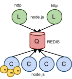

# ANNEX

## ARCHITECTURE

Rush Implements a **Producer&Consumer** (+Worker) architecture where we may have several Producer nodes (node listener.js) and Consumer nodes (node consumer.js). Both kind of nodes are implemented by **node.js** processes which intercommunicate due to a buffer/queue hosted by **REDIS**.
Every consumer will manage a pool of workers implementing Rush behaviour. They will also provide AddOns in order to extend policies or include new functionality associated to internal events.
**HTTP Header stamping** is used in order to pre-program the expected behaviour of each request.

[

## Implementing AddOns
Click the [link])(Implementing-Addons.md] for more info related to the implementation of AddOns. 